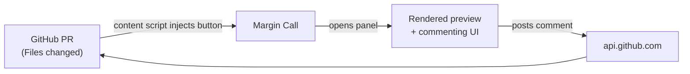

# Margin Call

> Comment on rendered markdown previews in GitHub PRs. The thing GitHub forgot.

[](https://chromewebstore.google.com/detail/margin-call/nblnlnpacfbabbopcojcmfjmjfpdeifh)
[](https://github.com/peter-trerotola/margin-call/actions/workflows/ci.yml)
[](./LICENSE)

## The problem

GitHub lets you leave inline comments on code in PRs. Line by line, with full context. It's great.

GitHub also lets you preview rendered markdown in PRs. Tables, headings, mermaid diagrams, the works.

GitHub does **not** let you do both at the same time. If you want to review a TRD, an RFC, an architecture doc, a changelog — anything where the rendered output is the thing that matters — you have to bounce between the rendered preview (no comments) and the raw markdown diff (no rendering, hard to read). Or you give up and load the doc into Google Docs.

## The solution

Margin Call is a Chrome Extension that adds a "Review Preview" button next to every markdown file on a PR's "Files changed" tab. Click it and you get the rendered markdown in a side panel. Select any text inside a section that was changed in the PR, click Comment, and your comment lands as a real GitHub PR review comment on the right line.

It also:

- Renders Mermaid diagrams from fenced ```mermaid blocks
- Highlights the changed sections in green so you know what you're reviewing
- Shows existing review comments inline next to the prose they refer to
- Handles light + dark mode based on your system preference
- Stores your GitHub OAuth token only in your own browser, talks only to api.github.com (no servers, no analytics, no third parties — see [PRIVACY.md](./docs/PRIVACY.md))

## Install

**[Install from the Chrome Web Store](https://chromewebstore.google.com/detail/margin-call/nblnlnpacfbabbopcojcmfjmjfpdeifh)**

Or download from [GitHub Releases](https://github.com/peter-trerotola/margin-call/releases) and sideload via `chrome://extensions`.

## How it works



Your browser does everything. There is no Margin Call server.

## Documentation

- **[docs/README.md](./docs/README.md)** — extended overview, quick start, troubleshooting
- **[docs/ARCHITECTURE.md](./docs/ARCHITECTURE.md)** — how the four extension components fit together
- **[docs/DEVELOPMENT.md](./docs/DEVELOPMENT.md)** — local dev setup (Docker + Make, no Node on host)
- **[docs/TESTING.md](./docs/TESTING.md)** — test strategy and how to run them
- **[docs/PRIVACY.md](./docs/PRIVACY.md)** — what data the extension touches (spoiler: not much)
- **[CONTRIBUTING.md](./CONTRIBUTING.md)** — how to send a PR

## License

MIT — see [LICENSE](./LICENSE).
