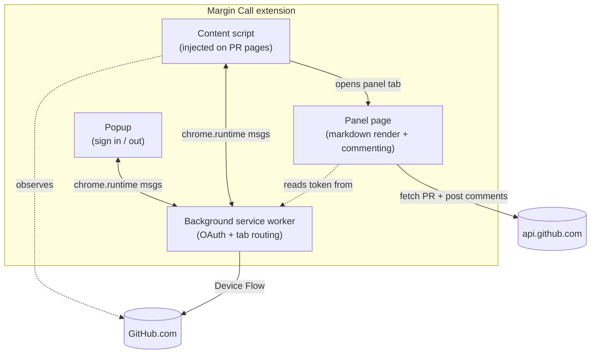
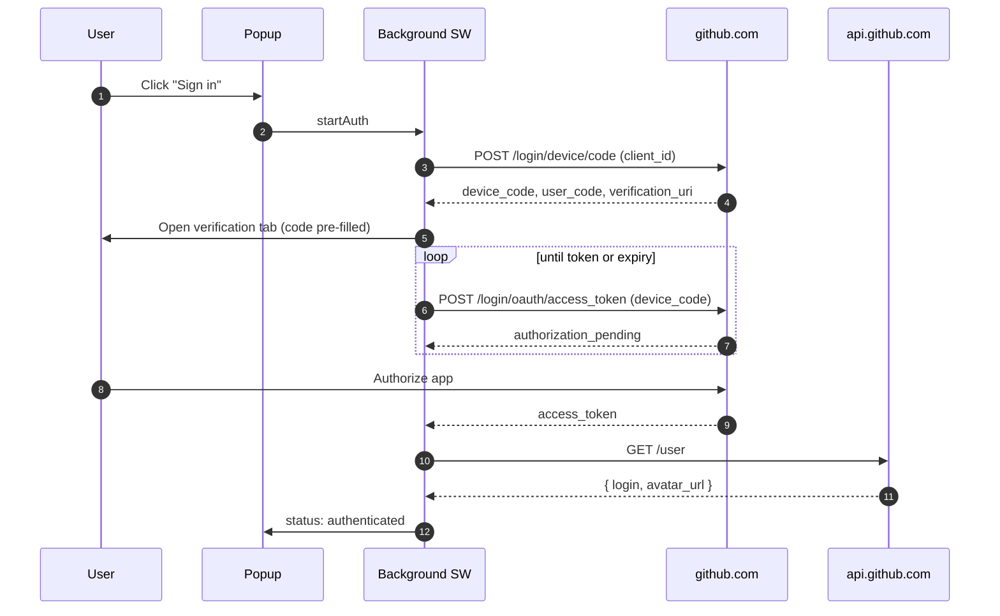

# Margin Call — Chrome Extension for GitHub PR Markdown Comments

Margin Call is a Chrome Extension (Manifest V3) that solves a fundamental GitHub limitation: you cannot write inline comments on rendered markdown previews in pull request "Files changed" pages. This extension adds that capability.

## The Problem

When reviewing a PR on GitHub, you can:
- Comment on code diffs with line-by-line precision
- View rendered markdown previews of `.md`, `.mdx`, and `.markdown` files

But you cannot do both simultaneously. If you want to comment on the rendered output of a markdown file, you have to either:
1. Leave the PR page and edit the markdown file locally
2. Write vague comments on the wrong file or the PR description
3. Use imprecise comment coordinates that don't align with the rendered text

Margin Call closes this gap.

## The Solution

The extension injects a "Review Preview" button next to each markdown file in the "Files changed" page. Clicking the button opens a side panel that displays the rendered markdown with full inline commenting capability. Comments are posted directly to GitHub via the PR Review Comments API, appearing alongside code review comments.

## Quick Start

Prerequisites: Docker, Make, Chrome (for manual testing).

```bash
# Build the Docker container, then compile the extension to dist/
make docker-build && make build

# Run all tests
make test
```

### Loading the extension in Chrome

1. Open `chrome://extensions`
2. Enable **Developer mode** (toggle in the top-right corner)
3. Click **Load unpacked**
4. Select the `dist/` directory in this project (not the project root — point at `dist/`)
5. The Margin Call icon appears in your extensions toolbar
6. Click the icon → **Sign in with GitHub** → authorize on the tab that opens
7. Open any PR with a `.md` file → "Files changed" tab → click **Review Preview** on a markdown file

After editing source code, run `make build` and click the reload button on the extension card in `chrome://extensions`.

### Commenting outside the diff

GitHub's web UI lets you comment on any line of a file in a PR, even lines that weren't changed. The GitHub REST API does not (it returns `422 line must be part of the diff`). Margin Call works around this by automatically falling back to a **file-level comment** when you select text that isn't in the diff.

When you select text:

- **Inside a green-bordered section** (added or context lines from the diff) → the button reads "Comment" and posts a normal line-anchored review comment on the right line
- **Outside the diff** → the button switches to "Comment on file"; submitting posts a file-level comment with your selected text quoted in the body. It appears in the "File-level comments" section at the top of the panel and shows up on the GitHub PR as a file-level review comment.

This matches what reviewers expect from github.com today, without losing line precision when it's available.

### Troubleshooting

**`Failed to load extension: Value 'key' is missing or invalid.`**
The `key` field in `manifest.json` must either be a valid Chrome extension public key or be omitted entirely — an empty string fails validation. If you see this after editing the manifest, ensure there is no `"key": ""` line. `make build` produces a valid manifest; if you have stale build output, run `make clean && make build`.

**`Could not load manifest.`**
Make sure you selected the `dist/` directory, not the project root. The repo root has `package.json` and other files, but the actual extension lives in `dist/` after `make build`.

**Sign-in opens a tab but never completes**
The popup polls every 2 seconds while it's open. If you click outside the popup it closes — reopen it and the polling resumes. The Device Flow code itself stays valid for 15 minutes; click **Sign in** again if it expires.

**No "Review Preview" button on a PR's markdown files**
Buttons only inject on the "Files changed" tab (`/pull/<number>/files`), not the conversation tab. Also confirm the file extension is `.md`, `.mdx`, or `.markdown`. After installing the extension, you may need to refresh PR pages that were already open.

## How It Works

Margin Call has four components, all running in the browser:



The Device Flow auth (no `client_secret` to leak) looks like this:



No server infrastructure. No external API calls. Everything runs in your browser, authenticated via your own GitHub OAuth token.

## Documentation

- [DEVELOPMENT.md](./DEVELOPMENT.md) — Setup, build, and development workflow
- [ARCHITECTURE.md](./ARCHITECTURE.md) — Technical deep-dive on components, data flow, and design decisions
- [TESTING.md](./TESTING.md) — Test strategy, running tests, and writing new tests
- [PUBLISHING.md](./PUBLISHING.md) — Chrome Web Store submission and update workflow

## Key Features

- **Zero server overhead** — Everything runs in your browser using your OAuth token
- **Line-accurate comments** — Maps rendered text selection back to source markdown lines
- **Diff-aware** — Only allows comments on lines that appear in the PR diff
- **GitHub API integration** — Posts comments as PR review comments, not general comments
- **Docker-based development** — No local Node.js required, consistent environment for all developers

## Version

0.1.0 (Pre-release)

## License

See LICENSE file in repository root.
