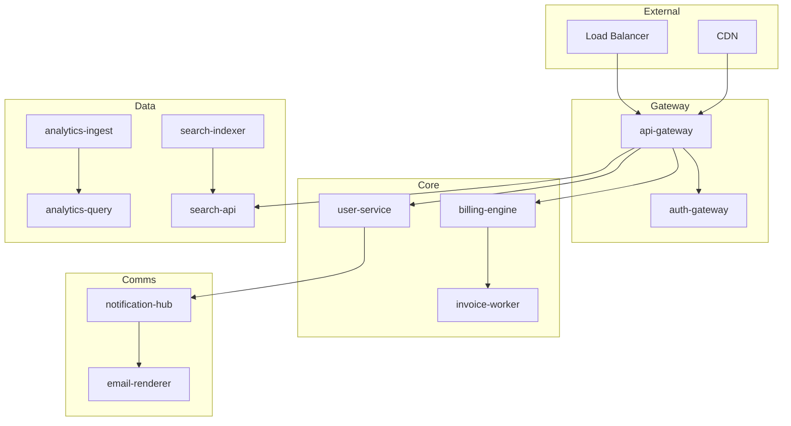

# Sample TRD — Margin Call test target

> **Why this file exists:** A real PR you can use to exercise every code path in the extension — especially table commenting, diff highlighting, and the sidebar layout.

## Service inventory

| # | Service | Owner | Language | Port | Database | Status | SLA | On-call | Deploy | Last incident | Notes |
|---|---------|-------|----------|------|----------|--------|-----|---------|--------|---------------|-------|
| 1 | auth-gateway | Platform | Go | 8080 | PostgreSQL | Active | 99.99% | @oncall-platform | Argo CD | 2026-03-12 | OAuth2 + OIDC provider |
| 2 | user-service | Identity | Go | 8081 | PostgreSQL | Active | 99.95% | @oncall-identity | Argo CD | 2026-02-28 | Profile + preferences |
| 3 | billing-engine | Payments | Rust | 8082 | CockroachDB | Active | 99.99% | @oncall-payments | Canary | 2026-04-01 | Stripe integration |
| 4 | invoice-worker | Payments | Rust | - | CockroachDB | Active | 99.9% | @oncall-payments | Canary | 2026-03-15 | Async invoice generation |
| 5 | notification-hub | Comms | TypeScript | 8083 | Redis | Active | 99.5% | @oncall-comms | Rolling | 2026-01-20 | Email, SMS, push |
| 6 | email-renderer | Comms | TypeScript | - | - | Active | 99.5% | @oncall-comms | Rolling | Never | MJML templates |
| 7 | search-indexer | Discovery | Python | - | Elasticsearch | Active | 99.0% | @oncall-discovery | Blue/green | 2026-03-01 | Full-text + faceted |
| 8 | search-api | Discovery | Go | 8084 | Elasticsearch | Active | 99.9% | @oncall-discovery | Blue/green | 2026-03-01 | Public search endpoint |
| 9 | media-processor | Content | Go | - | MinIO | Active | 99.5% | @oncall-content | Rolling | 2026-02-14 | Image resize, video transcode |
| 10 | cdn-origin | Content | Nginx | 443 | MinIO | Active | 99.99% | @oncall-infra | Immutable | Never | Static asset serving |
| 11 | feature-flags | Platform | Go | 8085 | Redis | Active | 99.99% | @oncall-platform | Argo CD | Never | LaunchDarkly replacement |
| 12 | config-service | Platform | Go | 8086 | etcd | Active | 99.99% | @oncall-platform | Argo CD | 2026-01-05 | Dynamic config |
| 13 | audit-logger | Compliance | Go | - | ClickHouse | Active | 99.9% | @oncall-compliance | Rolling | Never | Immutable audit trail |
| 14 | analytics-ingest | Data | Rust | 8087 | Kafka | Active | 99.5% | @oncall-data | Canary | 2026-03-20 | Event ingestion pipeline |
| 15 | analytics-query | Data | Python | 8088 | ClickHouse | Active | 99.0% | @oncall-data | Blue/green | 2026-03-20 | Dashboard queries |
| 16 | ml-inference | AI | Python | 8089 | - | Beta | 95.0% | @oncall-ai | Manual | 2026-04-10 | Recommendation engine |
| 17 | ml-training | AI | Python | - | S3 | Beta | - | @oncall-ai | Manual | Never | Nightly batch training |
| 18 | api-gateway | Platform | Go | 443 | - | Active | 99.99% | @oncall-platform | Argo CD | 2026-02-01 | Rate limiting, routing |
| 19 | admin-dashboard | Internal | TypeScript | 3000 | PostgreSQL | Active | 99.0% | @oncall-platform | Rolling | Never | Internal tools |
| 20 | webhook-relay | Integrations | Go | 8090 | Redis | Active | 99.9% | @oncall-integrations | Rolling | 2026-03-08 | Outbound webhooks |
| 21 | scheduler | Platform | Go | - | PostgreSQL | Active | 99.9% | @oncall-platform | Argo CD | 2026-01-15 | Cron + delayed jobs |
| 22 | secret-manager | Security | Go | 8091 | Vault | Active | 99.99% | @oncall-security | Immutable | Never | Secrets rotation |
| 23 | cert-manager | Security | Go | - | - | Active | 99.99% | @oncall-security | Immutable | Never | TLS cert automation |
| 24 | log-aggregator | Observability | Go | - | Loki | Active | 99.5% | @oncall-infra | Rolling | 2026-02-20 | Structured log pipeline |
| 25 | metrics-collector | Observability | Go | - | Prometheus | Active | 99.5% | @oncall-infra | Rolling | Never | Metrics scraping |
| 26 | trace-collector | Observability | Go | - | Tempo | Active | 99.5% | @oncall-infra | Rolling | Never | Distributed tracing |
| 27 | status-page | Observability | TypeScript | 3001 | PostgreSQL | Active | 99.9% | @oncall-infra | Rolling | Never | Public status page |
| 28 | tenant-manager | Multi-tenancy | Go | 8092 | PostgreSQL | Active | 99.99% | @oncall-platform | Argo CD | 2026-04-05 | Tenant provisioning |
| 29 | data-exporter | Compliance | Go | - | PostgreSQL | Active | 99.0% | @oncall-compliance | Rolling | Never | GDPR data export |
| 30 | chaos-agent | SRE | Go | - | - | Active | - | @oncall-sre | Manual | Never | Chaos engineering |

## Architecture diagram

## Migration timeline

| Phase | Target date | Scope | Risk | Owner | Dependencies | Rollback plan |
|-------|-------------|-------|------|-------|--------------|---------------|
| Phase 0 | 2026-05-01 | Shadow traffic routing | Low | Platform | Load balancer config | Disable shadow route |
| Phase 1 | 2026-05-15 | Auth gateway migration | High | Identity | New OIDC provider | Fall back to legacy auth |
| Phase 2 | 2026-06-01 | User service cutover | Medium | Identity | Auth gateway stable | Restore old user DB |
| Phase 3 | 2026-06-15 | Billing engine swap | High | Payments | User service stable | Revert Stripe webhook |
| Phase 4 | 2026-07-01 | Search reindex | Medium | Discovery | Content freeze window | Restore old ES index |
| Phase 5 | 2026-07-15 | Analytics pipeline | Low | Data | Kafka cluster ready | Replay from cold storage |
| Phase 6 | 2026-08-01 | ML inference rollout | Medium | AI | Training pipeline stable | Disable ML features |
| Phase 7 | 2026-08-15 | Legacy decommission | Low | Platform | All phases complete | N/A — point of no return |

## Open questions

1. Should we run dual-write during Phase 3 or cut over in a single deploy window?
2. What is the acceptable data loss window for analytics during the Kafka migration?
3. Do we need SOC 2 re-certification after the auth gateway change?
4. Can the chaos agent run in production during the migration, or only in staging?
