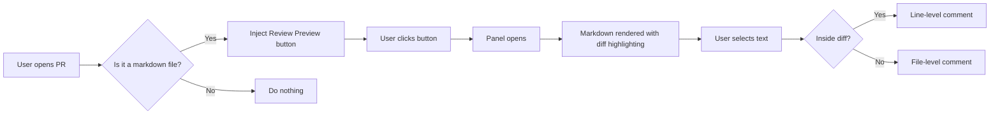
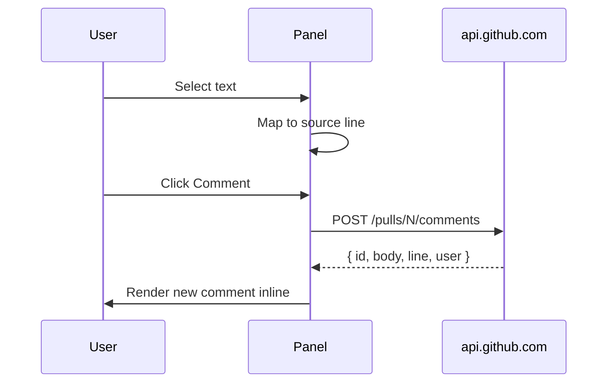

# Sample TRD — Margin Call test target

> **Why this file exists:** A real PR you can use to exercise every code path in the extension. Hits diff highlighting, mermaid rendering, line-level commenting, file-level fallback, comment threading, and dark/light mode.

## Test checklist

When the extension is loaded and the panel is open on this file, verify each of the following:

### Diff visualization

- [ ] The page header shows `+N` and `−N` chips
- [ ] All sections in this file have a green left border (this is a brand new file, so every line is "added")
- [ ] Numbered lists below render with intact numbers (no green line cutting through `1.` `2.`)
- [ ] Code blocks have the green border but their contents are unaffected

### Line-level commenting

- [ ] Selecting any text in this file → floating "Comment" button appears just below the selection
- [ ] Clicking it opens a comment form with the selected text quoted as `> ...`
- [ ] Submitting posts a real review comment to this PR; refresh the GitHub page to see it
- [ ] The new comment appears inline below the section you commented on

### File-level fallback

This file is brand new, so everything *is* in the diff and you'll always get the line-level path. To test the file-level fallback:

- [ ] Open the panel for an *existing* unchanged file in another PR
- [ ] Select text outside any green section → button changes to "Comment on file"
- [ ] Submit → comment lands in the "File-level comments" section at the top of the panel

### Mermaid

The flowchart below should render as a real diagram, not a code block.



A second diagram (sequence) to test multiple diagrams in one document:



### Light + dark mode

- [ ] Switch your OS appearance (System Settings → Appearance on macOS)
- [ ] The panel, popup, injected button, and Mermaid diagrams all swap themes

### GFM features

A table — should render with proper borders + alignment:

| Component | Where it lives | Tested by |
|-----------|----------------|-----------|
| Background SW | `src/background/index.ts` | `test/integration/oauth-flow.test.ts` |
| Content script | `src/content/index.ts` | `test/unit/content-injection.test.ts` |
| Panel renderer | `src/panel/renderer.ts` | `test/unit/renderer.test.ts` |
| Diff parser | `src/panel/diff-parser.ts` | `test/unit/diff-parser.test.ts` |

A task list:

- [x] Comment on a heading
- [x] Comment on a paragraph
- [ ] Comment on a list item
- [ ] Comment on a table cell
- [ ] Comment on a code block
- [ ] Comment on a Mermaid diagram (the wrapper, not the SVG internals)
- [ ] Reply to your own comment

A code block (regular fenced, not Mermaid):

```typescript
// Comment on a fenced code block — the whole block should be commentable
export function exampleFunction(input: string): string {
  return input.toUpperCase();
}
```

A blockquote with **bold** and *italic* and `inline code` and a [link](https://github.com/peter-trerotola/margin-call):

> This is a blockquote. Inside it: **bold text**, *italic text*, `inline code`, and a [link](https://example.com). Strikethrough also works: ~~old idea~~.

## Final smoke test

If every checkbox above passes, the extension is healthy. If any fail, file an issue at <https://github.com/peter-trerotola/margin-call/issues> with the failing item, your Chrome version, and the panel page console output.
